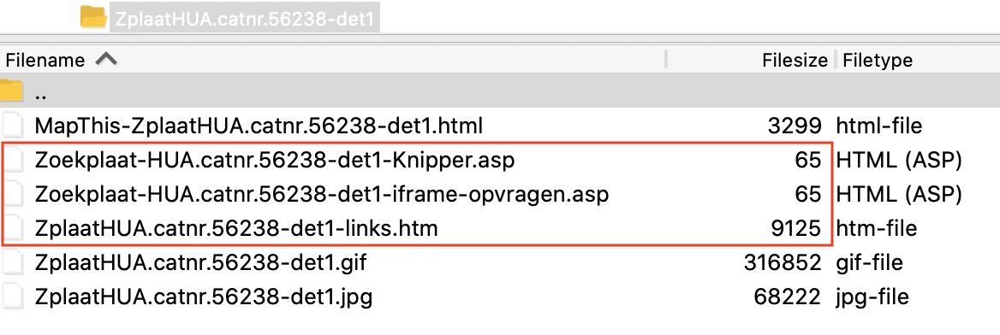
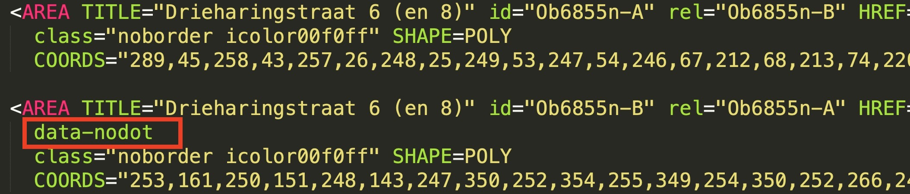
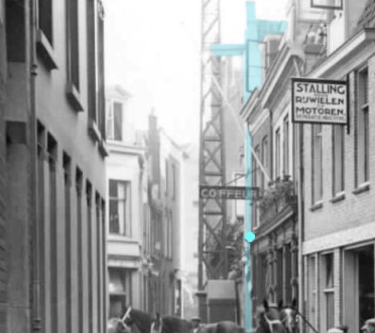
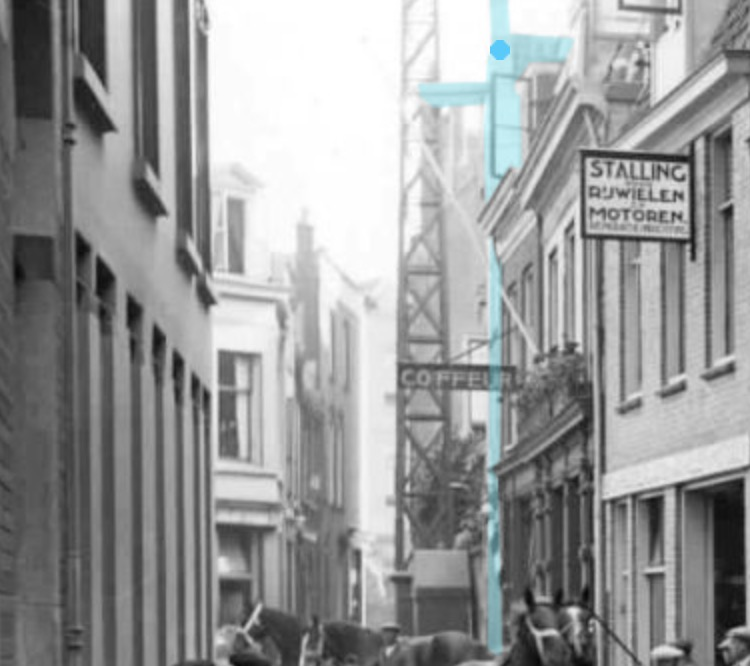
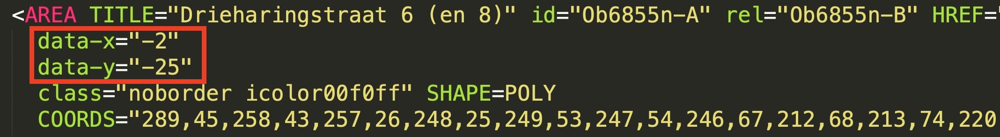
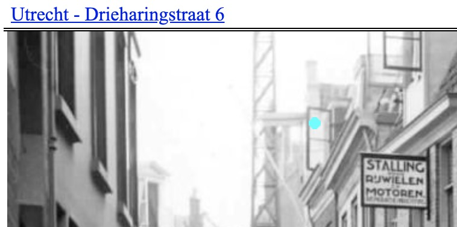
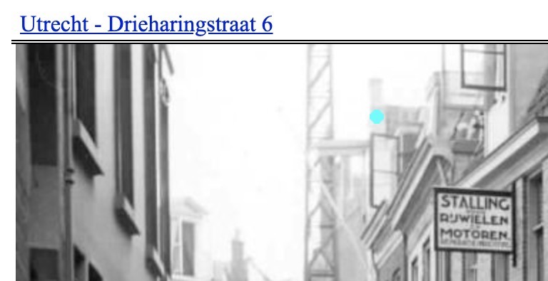

# Knipperendebolletjes
- Door Rick, Ivar en Simon - Utrecht Time Machine
- 30 maart, 17+18 april en 13 oktober 2020
- Open-source licentie volgens GNU General Public License v3.0

Een eenvoudige client-sided oplossing voor de 'knipperendebolletjes' op de zoekplaten op [documentatie.org](http://www.documentatie.org).
Dit werkt als volgt: Het Javascript bestand kijkt of er in de querystring van het `.htm` bestand dat geopend wordt een `?objectnr=Ob123n` wordt vermeld. In dat geval loopt het script langs alle `<AREA>` elementen op de pagina. Wanneer er in de `HREF` van de `AREA` verwezen wordt naar dit objectnummer dan wordt het middelpunt van de polygoon uitgerekend en wordt er op die plek een knipperend bolletje getoond.
Er zijn gevallen waar je geen bolletje wilt tonen of waarbij je het bolletje een klein beetje wilt verplaatsen tov het middelpunt. Dat is ook mogelijk door attributen toe te voegen aan het `<AREA>` element in kwestie.

We hopen dat dit het leven makkelijker maakt. Veel plezier en voor vragen weet je ons te vinden.

Groet!
Rick, Ivar en Simon

# Uitleg

## Stap 1 (eenmalig)
Download [knipperendebolletjes.js](https://raw.githubusercontent.com/utrecht-time-machine/UDS-Experiments/master/scripts/knipperendebolletjes.js) en upload deze via FTP naar de map `/scripts`

## Stap 2 (eenmalig)
Download [TrefwoordByObjectNr.asp](https://raw.githubusercontent.com/utrecht-time-machine/UDS-Experiments/master/scripts/TrefwoordByObjectNr.asp) en upload deze via FTP naar de map `/scripts`

## Stap 3 (eenmalig)
Download [iframe-opvragen-generiek.asp](https://raw.githubusercontent.com/utrecht-time-machine/knipperendebolletjes/master/scripts/iframe-opvragen-generiek.asp) en upload deze via FTP naar de map `/scripts`

## Stap 4
Open het `....-links.htm` (dit bestand bevat de `<AREA>` elementen) om het te bewerken en plaats de volgende regel code in de `<HEAD>` van het `.htm` bestand. 
```
<script type="text/javascript" src="/scripts/knipperendebolletjes.js"></script>
```


## Stap 5
Vervang de volledige inhoud van het bestand `...-Knipper.asp` door het volgende:
```
<!--#include virtual="/scripts/iframe-opvragen-generiek.asp"-->
```

## Stap 6
Vervang de volledige inhoud van het bestand `...-iframe-opvragen.asp` door het volgende:
```
<!--#include virtual="/scripts/iframe-opvragen-generiek.asp"-->
```

De map ziet er dan in FileZilla ongeveer als volgt uit:



## Optioneel

### Eén bolletje voor meerdere AREA's
In sommige gevallen wil je geen knipperend bolletje laten zien. Bijvoorbeeld als meerdere AREA's samen één groep vormen. Hiervoor kun je het `data-nodot` attribuut gebruiken. Wanneer er meerdere AREA's die in aanmerking komen voor een bolletje wordt alleen eerste getoond, tenzij deze eerste een `data-nodot` heeft, dan slaat ie die over en komt het bolletje bij de volgende te staan.



  


### Verplaatsen bolletje t.o.v. van het midden 
Wanneer een bolletje niet precies op de goede plek staat kun je d.m.v. de attributen `data-x` en `data-y` het bolletje de nodige pixels naar links/rechts en/of boven/onder verplaatsen.


  

