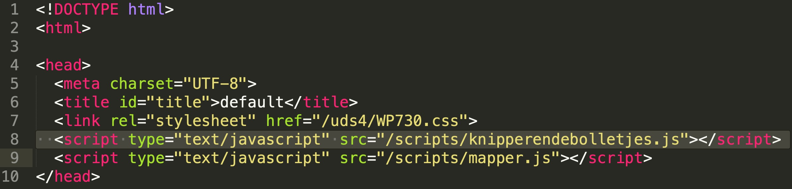

# Knipperendebolletjes
door Rick, Ivar en Simon - Utrecht Time Machine
30 maart + 13 oktober 2020
GNU General Public License v3.0

Een client-sided oplossing voor de 'knipperendebolletjes' op de zoekplaten op 
 [documentatie.org](http://www.documentatie.org)

# Uitleg

## Stap 1
Download [knipperendebolletjes.jpg](https://raw.githubusercontent.com/utrecht-time-machine/UDS-Experiments/master/scripts/knipperendebolletjes.js) en upload deze naar de map `http://www.documentatie.org/scripts/`

## Stap 2
Open het `....-links.htm` (dit bestand bevat de `<AREA>` elementen) om het te bewerken.

## Stap 3
Plaats de volgende in de `<HEAD>` van het `.htm` bestand. 
```<script type="text/javascript" src="/scripts/knipperendebolletjes.js"></script>```


